# Greep Pay — P2P Add Money UX Bounty Submission

**Test Account Email:** [INSERT YOUR TEST ACCOUNT EMAIL]
**Device:** Mobile
**Environment:** Production
**Scenarios Completed:** Happy Path (×2 attempts) + 3 Edge Cases + 2 Additional Bugs Discovered

---

## Screen Recording

🎥 **Full recording:** https://drive.google.com/file/d/1M-RAb-Bcm4Pfo_R08Up8CUyfDRQ21RQ8/view

Full screen recording covers the complete happy-path flow from Home → Fund → Currency Selection → Bank Transfer → Agent Match → Make Transfer → I've Sent The Money → Receipt Upload → Deposit Successful, plus all three edge-case scenarios documented below.

---

## Happy Path Result

**First deposit — completed successfully.** The full flow from currency selection through to "Deposit Successful" worked without interruption. The final USD amount credited matched what was shown on the amount entry screen before committing.

**Second deposit — failed with a critical blocker** (see Edge Case 2 below).

---

## Screenshots

### Step 1 — Home Screen
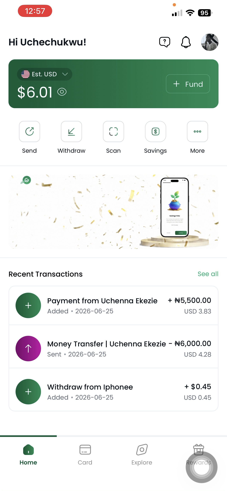

### Step 2 — Fund Screen (Fiat Toggle)
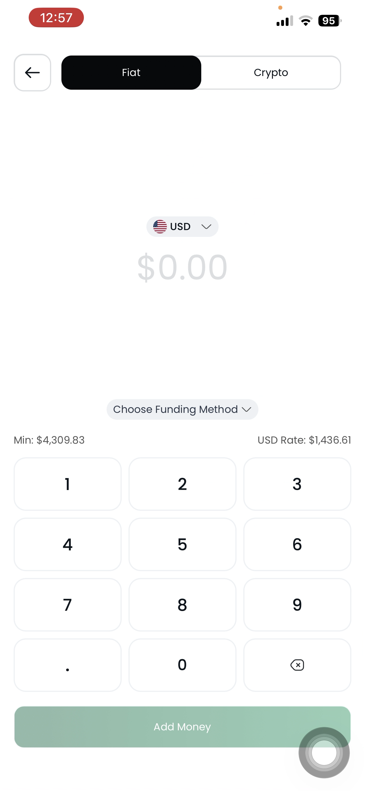

### Step 3 — Currency Selection
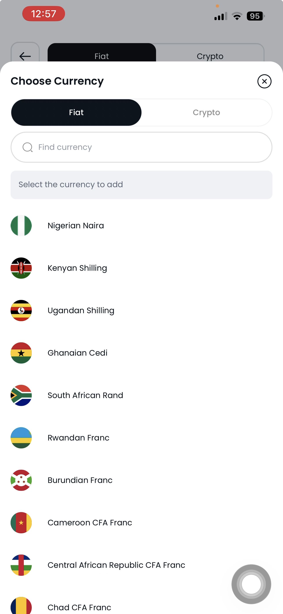

### Step 4 — Choose Deposit Method
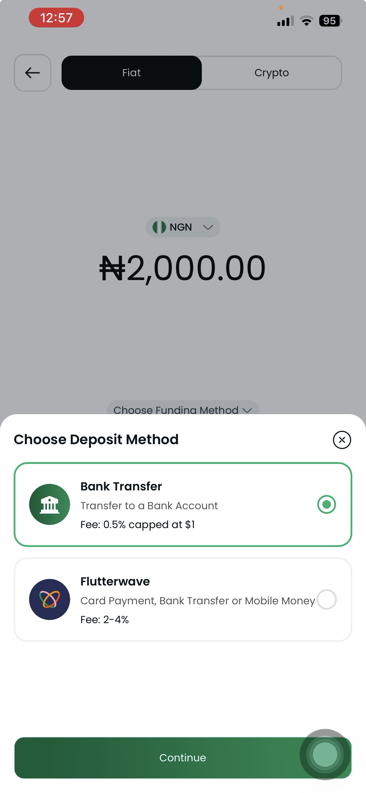

### Step 5 — Amount Entry & FX Rate
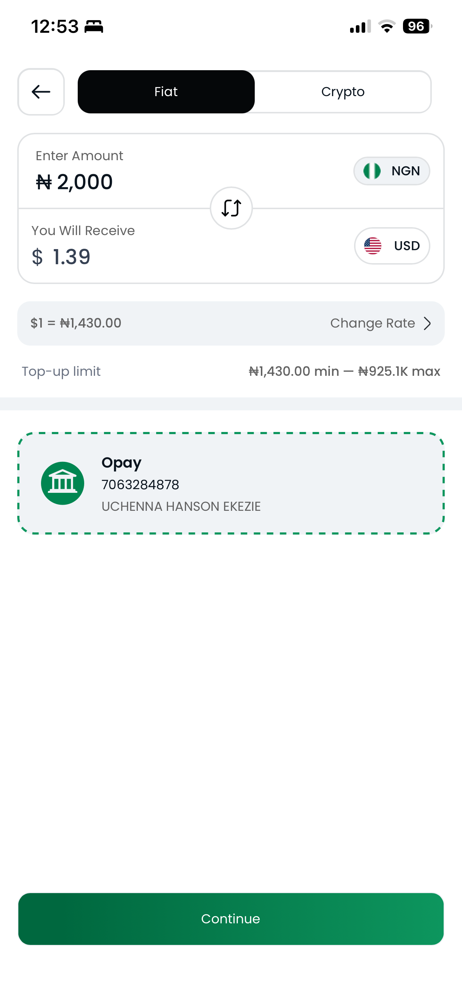

### Step 6 — Add New Bank Account
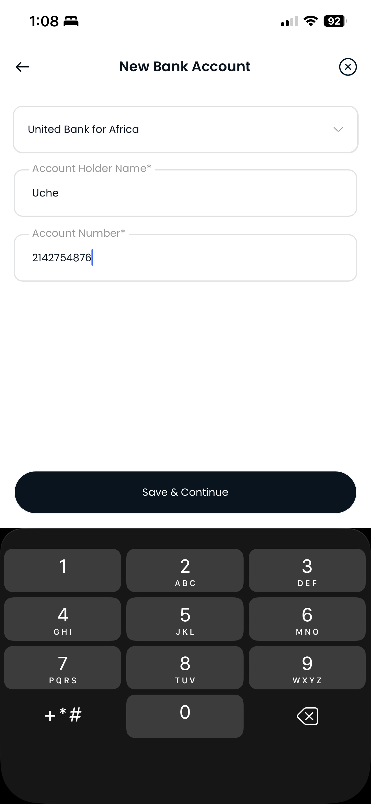

### Step 7 — Agent Match & Transfer Instructions (timer 14:56)
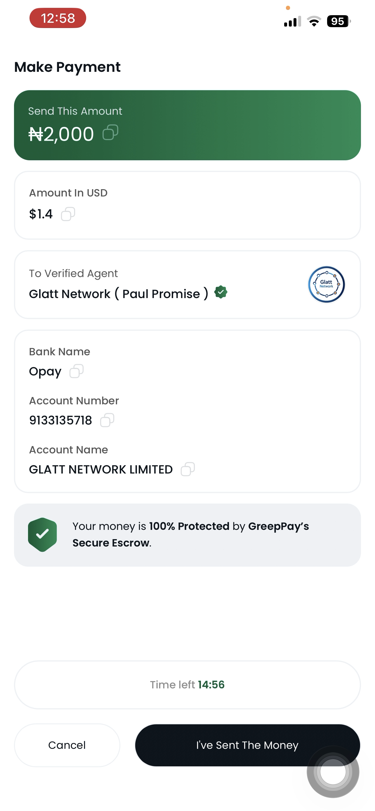

### Step 8 — Make Transfer (timer 14:40)
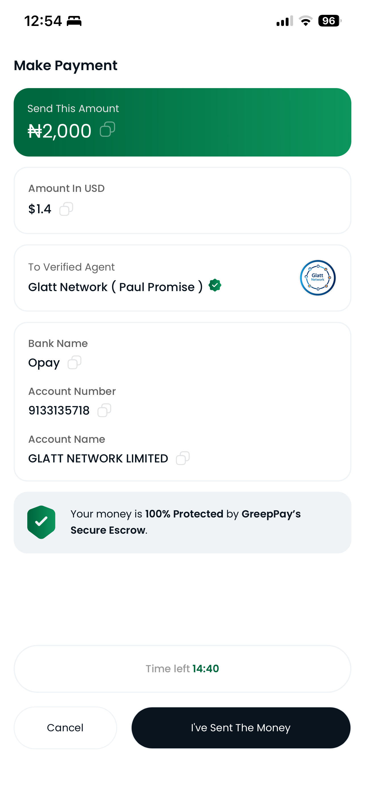

### Step 9 — Receipt Upload (successful)
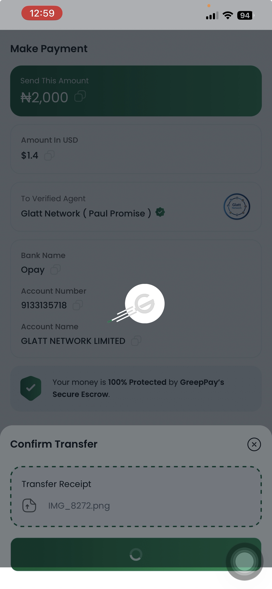

### Step 10 — Transaction Details (See Details)
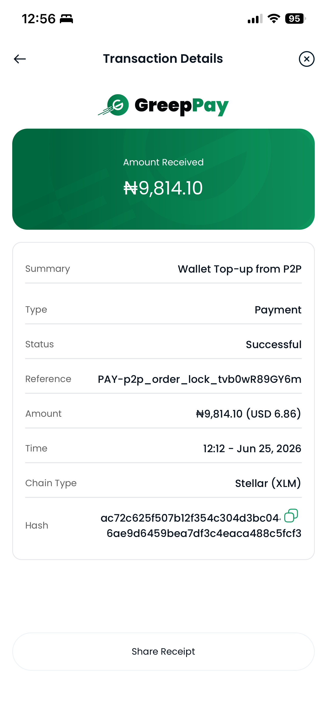

### Step 11 — Home Screen After Second Deposit Arrived
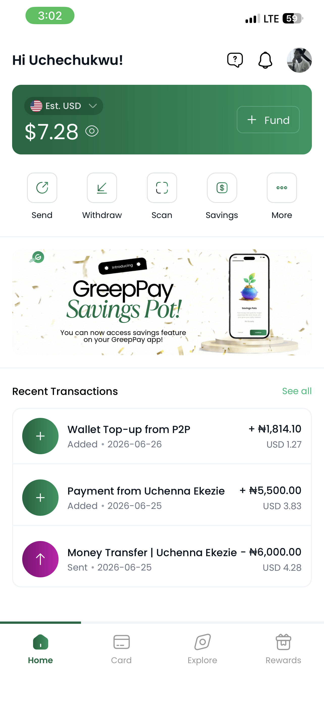

---

### Bug 1 — White Screen After Timer Expiry
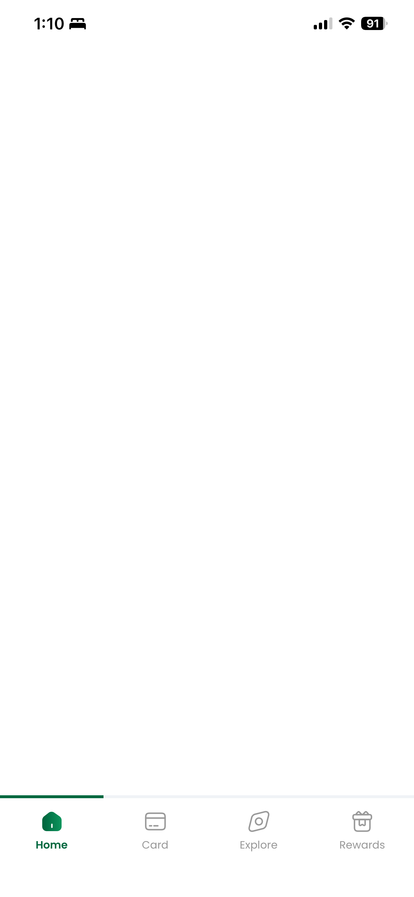

### Bug 2 — Transaction Notifications Not Working
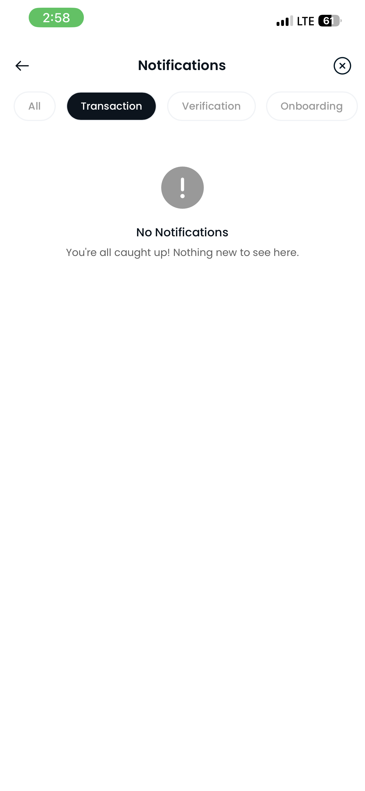

---

### Edge Case 1 — Bank Account Validation Error
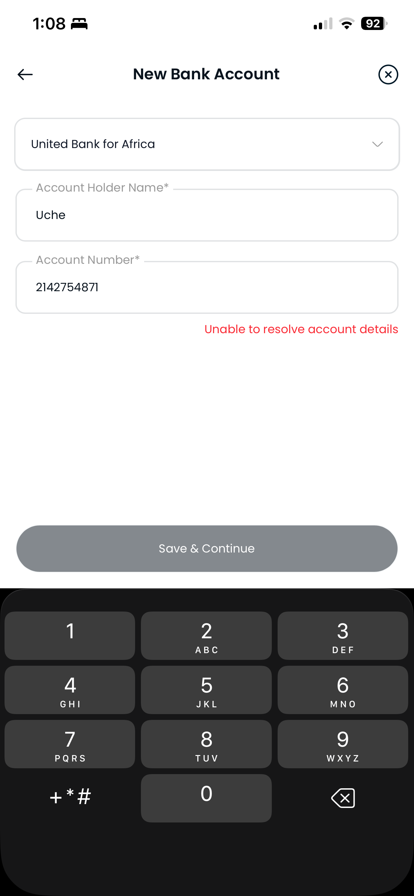

### Edge Case 3 — No Receipt Upload Error
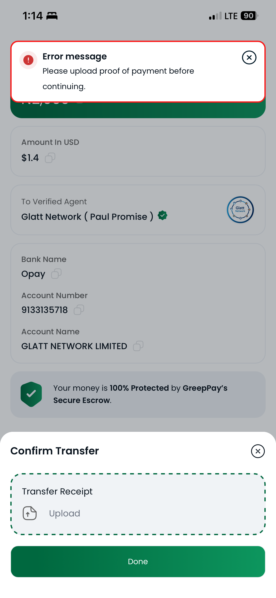

---

## Edge Case Results

### Edge Case 1 — Add new bank account with incomplete/incorrect details
**Steps:** On the bank account selection screen, tapped "Add New" and submitted with incorrect account details (wrong account number for the selected bank).
**Expected:** Clear validation error explaining which field is wrong.
**Actual:** Error message displayed in red: "Unable to resolve account details."
**Assessment:** The error appeared and prevented progression, which is correct behaviour. However, the copy is vague — it does not tell the user whether the account number is wrong, the bank selection is incorrect, or the name does not match. A more specific message such as "We couldn't verify this account number with United Bank for Africa — please check the number and try again" would reduce confusion and retry friction.
**Severity:** Medium
**Recovery:** User can correct details and retry — no dead end.

---

### Edge Case 2 — Let the 14:59 countdown timer expire ⚠️ CRITICAL BUG

**Steps:**
1. Completed the full deposit flow up to the Make Transfer screen
2. Allowed the 14:59 countdown timer to expire without tapping "I've Sent The Money"
3. Closed and restarted the app

**Expected:** The app should show a clear "session expired" or "processing" screen and log the transaction in history so the user can track status or raise a dispute.

**Actual:**
- After restarting the app the screen went **completely white** — blank, no content, no error, no loading indicator
- The transaction did **not appear in transaction history** at the time of the white screen
- No way to raise a dispute — no reference number, no trace anywhere in the app
- Funds **did eventually arrive** (₦1,814.10 credited on Jun 26, visible on the home screen when reopened later)
- **Zero notification was sent** when funds landed — discovered only by manually checking the balance

**Impact:** Between the timer expiring and funds finally arriving, the user had no feedback at all:
1. Blank white screen on relaunch — no indication of what happened
2. No transaction in history — impossible to know if money was lost or processing
3. No push notification when funds eventually landed
4. No reference number to contact support with if funds had not arrived

A user who did not return to check hours later would assume the money was lost.

**Severity:** Critical
**Repro steps:**
1. Start a Bank Transfer deposit — NGN → Bank Transfer → enter amount → match agent
2. On the Make Transfer screen, do not tap "I've Sent The Money"
3. Wait for the 14:59 timer to reach 0:00
4. Close the app completely and reopen
5. Observe blank white screen — no history entry, no error
6. Open Notifications → Transaction tab — no notification sent

**Expected fix:** Sessions that expire should show a clear status screen (processing / timed out) with a support link. Push notifications must fire when funds land. All transactions in any state must appear in history.

---

### Edge Case 3 — Tap "I've Sent The Money" without uploading a receipt
**Steps:** Reached the Confirm Transfer screen, did not upload any image, tapped Done.
**Expected:** App should block the action and prompt for upload.
**Actual:** Toast message displayed: "Please upload proof of payment before continuing." App correctly blocked progression.
**Assessment:** This works as intended. The error message is clear and actionable. No dead end.
**Severity:** N/A — working correctly.

---

## Answers to the 12 UX Feature Questions

**1. Currency selection & search**
Finding Nigerian Naira (NGN) was straightforward. The currency list is well-organised and the search function works correctly — typing the first two letters of a currency name returns accurate results. All advertised African currencies (NGN, GHC, ZAR, KES) were present with their correct country flags. No mislabelling observed.

**2. Deposit method clarity**
The screen clearly separates Fiat and Crypto modes with a toggle, setting the right context before method selection. On the Choose Deposit Method screen, all options are listed with their fee percentages. While the fee numbers are visible, there is no description explaining what each method is or who it suits. A first-time user may not know the difference between Yellow Card and Spotflow. A one-line label under each option — e.g. "Peer-to-peer agent transfer" for Bank Transfer — would improve decision-making confidence significantly.

**3. FX rate transparency**
The conversion rate is displayed clearly on the amount entry screen and updates in real time as the user types. The format "$1 = NGN 1,430" is easy to read and the USD amount is shown immediately below the local currency input. The minimum (₦1,430) and maximum (₦925.1K) limits are visible on the same screen without scrolling. This gives enough information to make an informed decision before committing.

**4. Bank account selection and add flow**
Adding a new bank account was seamless under normal conditions — the form is simple and the bank selection list is searchable. The flow does not explicitly state that the account must be in the depositor's own name. A clear note such as "This account must be in your name — third-party accounts are not accepted" would prevent user errors and reduce failed transfers caused by name mismatches.

**5. Agent matching and trust signals**
The verified badge and agent name shown on the Make Payment screen are reassuring. The agent's bank name, account number, and account name are clearly displayed. The escrow message "Your money is 100% Protected by GreepPay's Secure Escrow" reinforces safety. A brief indicator of the agent's completion rate or number of successful transactions would further strengthen trust for new users sending money for the first time.

**6. Transfer instructions accuracy**
The account number, bank name, and account name on the Make Transfer screen are easy to read and reference. Details were consistent from agent match through to the final Make Transfer screen — no discrepancies observed. A copy-to-clipboard function for the account number worked correctly, which is essential for users switching between the Greep Pay app and their banking app mid-transfer.

**7. Countdown timer pressure**
The 14:59 timer provides a reasonable window for completing a bank transfer and the visual countdown is clear throughout. It leans slightly toward pressure — there is no on-screen explanation of what happens when the timer expires, leaving users to assume. A short note such as "If the timer expires, your session resets — your money is safe" would reduce anxiety. Note: the current behaviour when the timer expires is a critical bug (see Edge Case 2 above).

**8. "I've Sent The Money" confirmation step**
The button label makes the self-attestation nature of this step reasonably clear — the user is affirming they have acted, not receiving automatic verification. However, the screen does not state that the agent still needs to verify the transfer before funds are released. Adding one line — "Your agent will confirm receipt shortly. Funds are held in escrow until then" — would set the correct expectation and reduce post-submission anxiety.

**9. Proof-of-payment upload**
The receipt upload step is easy to use. The UI presents a clear upload button, accepts gallery images, shows the file name after selection, and correctly blocks progression if skipped. The screen does not explain why the receipt is required. A brief line — "Your receipt protects you in any dispute" — would increase user willingness to comply and reduce drop-off at this step.

**10. Escrow and security messaging**
The "Your money is 100% Protected by GreepPay's Secure Escrow" message is displayed prominently on the Make Payment screen. The language is more reassuring than generic — naming "escrow" as the mechanism is more credible than simply saying "your money is safe." For users unfamiliar with escrow, a one-tap tooltip explaining what it means in practice would strengthen the message further.

**11. Final confirmation and receipt sharing**
The Transaction Details screen clearly communicates that funds have been credited, showing the full breakdown: amount, type, status (Successful), reference number, timestamp, chain type (Stellar XLM), and transaction hash. The "Share Receipt" button produces a shareable output. The overall experience at this stage is polished and leaves the user confident the transaction is complete.

**12. End-to-end time-to-fund perception**
The first deposit flow felt fast, transparent, and well-structured. The FX rate was honest, agent matching was near-instant, and the step-by-step flow left little room for confusion on the happy path. Compared to a traditional bank wire, the experience is significantly faster and more transparent about fees. The main factor that would prevent repeat use is the timer-expiry bug on the second deposit — a blank white screen with no feedback and no notification when funds eventually landed is a trust-breaking experience. With that issue resolved and transaction notifications working, this flow would comfortably compete with established remittance apps for African diaspora users.

---

## Bugs and Blockers Summary

| # | Screen | Steps to reproduce | Expected | Actual | Severity |
|---|--------|-------------------|----------|--------|----------|
| 1 | Add Bank Account | Submit form with incorrect account number | Field-level error naming the problem | Vague "Unable to resolve account details" — no field guidance | Medium |
| 2 | Make Transfer → timer expiry | Let 14:59 expire → close and reopen app | Session expired screen + transaction logged in history | Blank white screen; no history entry; no recovery path | **Critical** |
| 3 | Transaction Notifications | Complete any P2P deposit → open Notifications → Transaction tab | Push notification + in-app notification when funds land | "No Notifications" shown — zero notification sent for confirmed deposit | **High** |
| 4 | Post-timer fund delivery | Funds arrive after timer-expired session | Push notification + immediate history entry | Funds arrived silently hours later — no notification, no history until balance manually refreshed | **High** |
| 5 | Receipt Upload | Tap Done without uploading receipt | App blocks and prompts for upload | Correctly blocked with clear toast message | ✅ Works as intended |
